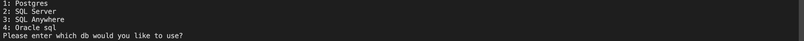

# FYP-3
Step 1: Download the tpc-ds benchmark from https://github.com/databricks/tpcds-kit

Step 2: After downloading and extracting the benchmark open the tools folder in the tpc-ds kit folder and run an executable file called MAKEFILE.

step 3: After running the make file. Open up terminal (or command prompt if using windows) go into the tpcds tools directory. In the tools directory run command “ ./dsdgen – scale 100 -dir/tmp” Scale defines the amount of data you need to generate. The official scale factors are 1TB, TB, 10 TB etc. We generated a total of 1gb data so we used SF= 1. -dir/tmp defines which directory to store the generated data in.

step 4: The files generated from the dsdgen are in .dat format which are then converted into csv files using Microsoft Excel. The columns are delimited by “|”

step 5: After you have generated the dataset. Download any database management studio which support View Materialization. For this manual purpose I will be using POSTGRES.

step 6: Create a database in the database management system and create tales. The create table SQL queries are provided in the tpcds-tools folder named “tpcds source.sql”. After creating the tables import the data into those tables.

step 7: After loading data in the dbms just run the python code and select the respective database management system

